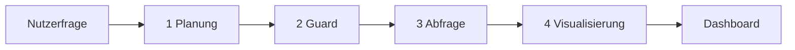

# SIMAP Explorer

Konversationelles BI-Projekt für Schweizer öffentliche Beschaffungsdaten (SIMAP).
Nutzer stellen Fragen in natürlicher Sprache; eine Agenten-Pipeline übersetzt sie
in validierte Read-only-SQL-Abfragen, visualisiert die Ergebnisse mit zwei
unabhängigen LLMs und erklärt sie kurz.

> FHNW Olten · Modul Business Intelligence · Saliou Dieng bei Prof. Dr. Manuel Renold
> Datenquelle: [simap.ch](https://www.simap.ch) · ~200 000 Vergabeeinträge in Supabase

---

## Die Pipeline

Jede Frage durchläuft vier Stufen. Sie sind das Herzstück des Projekts und trennen
Verstehen, Absichern, Auswerten und Darstellen sauber voneinander.



| Stufe | Rolle | Modell | Output |
|------|------|--------|--------|
| **1 Planung** | Analytics Planner | DeepSeek V4 Flash | Analyseplan, Intent, Filter |
| **2 Guard** | SQL-Kompilierung & Guardrails | regelbasiert | validiertes SQL, Parameter, Limit |
| **3 Abfrage** | Supabase `public.archive` | Postgres Read-only | aggregierte Zeilen |
| **4 Visualisierung** | Chart-Agent A & B | DeepSeek + Gemini | zwei Diagramme, Insights, Caveat |

Guardrails sind durchgehend aktiv: Prompt-Guard, SQL-Guard und Kantonsprüfung
schließen Freitext-SQL und Schreibzugriffe strukturell aus. Die ausführliche
Pipeline-Darstellung steht in der App unter **/dokumentation**.

---

## Projektstruktur

```
simap-explorer/
├── app/                      # Next.js App Router – Seiten & API-Routen
│   ├── page.tsx              # Landing / Chat-Einstieg
│   ├── dashboard/            # Dashboard mit anheftbaren Charts
│   ├── dokumentation/        # Pipeline-Doku & Projektbeschrieb
│   ├── login/                # Login-Gate
│   └── api/
│       ├── login/            # Auth-Cookie-Route
│       └── agent/chat/       # Pipeline-Endpunkt (Streaming, NDJSON)
│
├── components/
│   ├── about/                # PipelineFlow
│   ├── charts/               # ChartRenderer, Download-Buttons
│   ├── chat/                 # Chat-Panel, Nachrichten, Kantonsauswahl
│   ├── dashboard/            # KPI-Karten, Chart-Karten, Pin-Button
│   ├── layout/               # Navbar, Sidebar
│   └── ui/                   # Wiederverwendbare UI-Primitive (Button, Card …)
│
├── lib/
│   ├── agents/               # Pipeline-Logik
│   │   ├── openrouter-sql-agent.ts      # Stufe 1: Planner
│   │   ├── analytics-query-compiler.ts  # Stufe 2: SQL-Kompilierung
│   │   ├── planner-sql-agent.ts         # Fallback-Planner + Normalisierung
│   │   ├── openrouter-chart-agent.ts    # Stufe 4: Chart-Agent (OpenRouter)
│   │   ├── chart-agent-a.ts / -b.ts     # Lokale Fallback-Chart-Agenten
│   │   └── types.ts                     # Gemeinsame Typen & Schemas
│   ├── security/             # Guardrails (prompt-guard, sql-guard)
│   ├── db/readonly-postgres.ts          # Read-only DB-Zugriff (Stufe 3)
│   ├── ai/openrouter.ts                 # OpenRouter-Client
│   └── config/               # Kantone, CPV, Schema
│
├── hooks/use-agent-chat.ts   # Client-State für Streaming-Pipeline
├── types/                    # Geteilte App-Typen
├── tests/                    # Guardrail-Tests
├── docs/wireframes/          # Frühe HTML-/JSX-Entwürfe (archiviert)
├── middleware.ts             # Login-Gate-Middleware
├── AGENTS.md                 # Projektauftrag für KI-Agenten
└── .env.example              # Vorlage für Environment-Variablen
```

### Dateien im Root erklären

Die Dateien im Wurzelverzeichnis sind die Pflicht-Konfiguration eines
Next.js-Projekts – sie gehören dort hin und werden nicht verschoben:

| Datei | Rolle |
|-------|-------|
| `package.json` / `package-lock.json` | Abhängigkeiten und lockfile (npm) |
| `tsconfig.json` | TypeScript-Konfiguration & Pfad-Aliase `@/*` |
| `next.config.mjs` | Next.js-Konfiguration |
| `next-env.d.ts` | Von Next.js auto-generiert (nicht manuell ändern) |
| `middleware.ts` | Login-Gate-Middleware |
| `tailwind.config.ts` / `postcss.config.mjs` | Tailwind-CSS-Setup |
| `.eslintrc.json` | Linting-Regeln (`npm run lint`) |
| `.gitignore` / `.env.example` | Git- bzw. Environment-Vorlagen |
| `README.md` / `AGENTS.md` / `LICENSE` | Doku, Projektauftrag, Lizenz |

---

## Schnellstart

```bash
npm install
cp .env.example .env.local      # Werte eintragen (siehe unten)
npm run dev                     # http://localhost:3000
```

Tests der Guardrails:

```bash
npm test
```

### Environment-Variablen (`.env.local`)

Alle Schlüssel sind **serverseitig** – niemals mit `NEXT_PUBLIC_` prefixen.

| Variable | Bedeutung |
|----------|-----------|
| `DATABASE_READONLY_URL` | Read-only Postgres-Verbindung zu Supabase |
| `NEXT_PUBLIC_SUPABASE_URL` | Supabase-Projekt-URL (öffentlich) |
| `NEXT_PUBLIC_SUPABASE_ANON_KEY` | Supabase-Anon-Key (öffentlich) |
| `OPENROUTER_API_KEY` | OpenRouter-API-Key für LLM-Aufrufe |
| `OPENROUTER_SQL_MODEL` | Modell für Stufe 1 (Planner) |
| `OPENROUTER_CHART_MODEL_A` | Modell für Chart-Agent A |
| `OPENROUTER_CHART_MODEL_B` | Modell für Chart-Agent B |
| `APP_LOGIN_USERNAME` / `APP_LOGIN_PASSWORD` | Login-Gate (beide leer = Gate lokal deaktiviert) |

---

## Tech Stack

Next.js 15 (App Router) · React 19 · TypeScript · Tailwind CSS · Recharts ·
Supabase / Postgres · OpenRouter (DeepSeek, Gemini) · Vercel-Deployment

## Lizenz

MIT – siehe [LICENSE](LICENSE).
