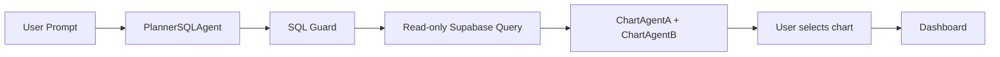

# simap-explorer

## 3-Agent BI Workflow

This project contains a simple agentic BI workflow for SIMAP data:

- `PlannerSQLAgent` receives the user prompt, creates a short plan, and writes one read-only PostgreSQL `SELECT` query.
- `SQL Guard` validates that the generated SQL stays read-only and only targets the configured SIMAP table and columns.
- Supabase/Postgres executes the query through `DATABASE_READONLY_URL`, which should point to the read-only database user.
- `ChartAgentA` and `ChartAgentB` receive the same SQL result and create two different chart configuration alternatives.
- The user chooses which chart to keep and pins it to the dashboard. This is the human-in-the-loop step.

Edit `lib/config/simap-schema.ts` to set the real SIMAP table name and allowed columns.